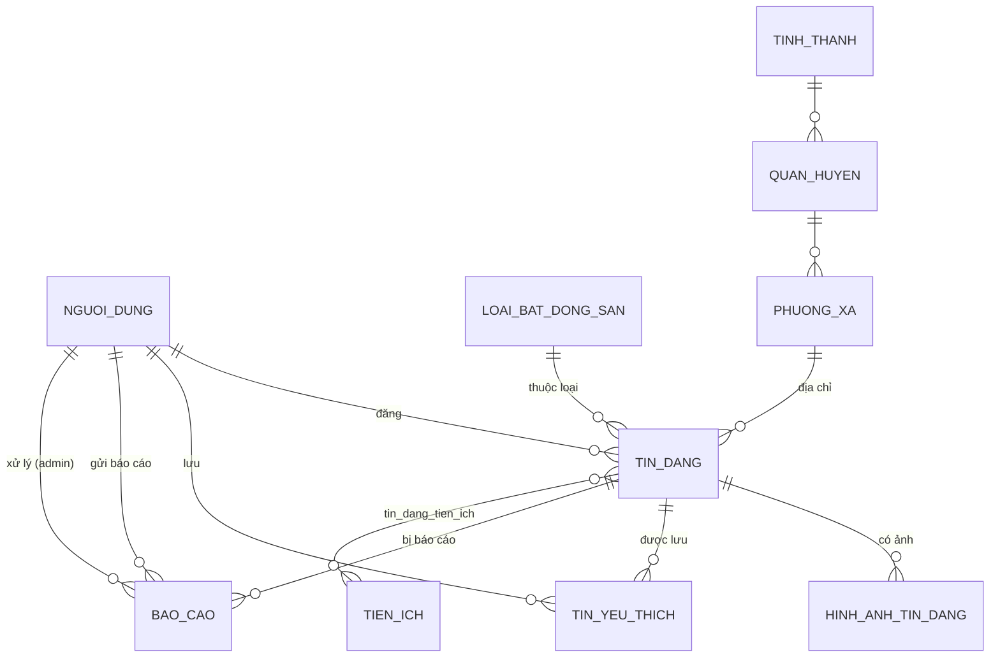

# ERD — UrbanLease (nền tảng đăng tin cho thuê nhà)

Nguồn nghiệp vụ: `docs/yêu cầu.md` + ảnh màn hình trong `docs/hình ảnh/` (khách chưa đăng nhập xem/lọc tin;
người dùng đăng nhập đăng/sửa/xóa/ẩn tin, lưu tin yêu thích; quản trị viên duyệt/khóa tin, quản lý người dùng,
quản lý loại bất động sản, xử lý tin bị báo cáo).

Cách làm: **code-first** — model SQLAlchemy trong `app/models/` là nguồn sự thật, sau đó dùng Alembic
autogenerate ra migration (`alembic/versions/`) để tạo schema thật trên PostgreSQL. Không dùng
`Base.metadata.create_all()`.

> Ghi chú: bảng/field đặt tên tiếng Việt không dấu, kiểu `snake_case` (Postgres không hỗ trợ tốt định danh có
> dấu/khoảng trắng nếu không quote).

## Sơ đồ quan hệ



## Bảng & field

Tất cả khóa chính là `id` kiểu serial (Integer, autoincrement), trừ bảng nối `tin_dang_tien_ich` dùng khóa
chính ghép.

### `nguoi_dung`
Tài khoản người dùng (người thuê/người đăng tin) và quản trị viên.

| Field | Kiểu | Ghi chú |
|---|---|---|
| id | Integer PK | |
| ho_ten | String(150) | |
| email | String(150) | unique, index — dùng đăng nhập |
| mat_khau_hash | String(255) | mật khẩu đã băm, không lưu plain text |
| so_dien_thoai | String(20) | nullable |
| vai_tro | Enum: `nguoi_dung`, `quan_tri` | phân quyền |
| trang_thai | Enum: `cho_xac_minh`, `hoat_dong`, `bi_khoa` | khớp màn "Quản trị hệ thống" (xác minh user mới / khóa user) |
| ngay_tao, ngay_cap_nhat | DateTime(tz) | server_default now() |

### `tinh_thanh` / `quan_huyen` / `phuong_xa`
Hệ thống địa giới hành chính 3 cấp, phục vụ "Lọc theo tỉnh/thành, quận/huyện" và form đăng tin.

| Bảng | Field | Ghi chú |
|---|---|---|
| tinh_thanh | id, ten(unique) | cấp tỉnh/thành |
| quan_huyen | id, ten, tinh_thanh_id(FK) | cấp quận/huyện |
| phuong_xa | id, ten, quan_huyen_id(FK) | cấp phường/xã — `tin_dang` gắn vào cấp này |

### `loai_bat_dong_san`
Loại hình bất động sản — admin quản lý được ("Quản lý loại bất động sản").

| Field | Kiểu | Ghi chú |
|---|---|---|
| id | Integer PK | |
| ten | String(100) unique | Phòng trọ / Căn hộ / Nhà nguyên căn (seed sẵn) |
| mo_ta | String(255) nullable | |

### `tien_ich`
Danh mục tiện ích của tin đăng (WiFi, chỗ đậu xe, thang máy, bảo vệ 24/7, nội thất cơ bản, máy lạnh — seed sẵn,
lấy từ form "Đăng tin cho thuê").

### `tin_dang`
Bảng trung tâm — 1 tin đăng cho thuê.

| Field | Kiểu | Ghi chú |
|---|---|---|
| id | Integer PK | |
| tieu_de | String(150) | |
| mo_ta | Text | |
| gia_thue | Numeric(14,2) | đơn vị VNĐ/tháng |
| dien_tich | Numeric(8,2) | đơn vị m² |
| dia_chi_chi_tiet | String(255) | số nhà, tên đường |
| loai_bat_dong_san_id | Integer FK → loai_bat_dong_san.id | |
| phuong_xa_id | Integer FK → phuong_xa.id | |
| nguoi_dang_id | Integer FK → nguoi_dung.id | người đăng tin |
| ten_nguoi_lien_he, so_dien_thoai_lien_he | String | thông tin liên hệ hiển thị trên tin, có thể khác hồ sơ user |
| phuong_thuc_lien_he_uu_tien | Enum: `goi_dien`, `nhan_tin` | |
| trang_thai | Enum: `cho_duyet`, `da_duyet`, `bi_khoa`, `an`, `da_xoa` | `bi_khoa` do admin duyệt/khóa; `an`/`da_xoa` do chủ tin tự ẩn/xóa (xóa mềm để giữ lịch sử ảnh/báo cáo) |
| ly_do_khoa | String(255) nullable | admin ghi lý do khi khóa tin |
| luot_xem | Integer default 0 | |
| ngay_dang, ngay_cap_nhat | DateTime(tz) | |

### `hinh_anh_tin_dang`
Ảnh của 1 tin đăng (1-N).

| Field | Kiểu | Ghi chú |
|---|---|---|
| id | Integer PK | |
| tin_dang_id | Integer FK → tin_dang.id | |
| duong_dan_anh | String(500) | đường dẫn/URL ảnh (lưu ở MinIO) |
| thu_tu_hien_thi | Integer default 0 | |
| la_anh_dai_dien | Boolean default false | ảnh đầu tiên = ảnh đại diện |

### `tin_dang_tien_ich`
Bảng nối N-N giữa `tin_dang` và `tien_ich`. Khóa chính ghép `(tin_dang_id, tien_ich_id)`, không có `id` riêng.

### `tin_yeu_thich`
Tin người dùng đã lưu ("Lưu tin yêu thích").

| Field | Kiểu | Ghi chú |
|---|---|---|
| id | Integer PK | |
| nguoi_dung_id | Integer FK → nguoi_dung.id | |
| tin_dang_id | Integer FK → tin_dang.id | |
| ngay_luu | DateTime(tz) | |

Ràng buộc unique `(nguoi_dung_id, tin_dang_id)` — 1 người chỉ lưu 1 tin 1 lần.

### `bao_cao`
Tin bị báo cáo ("Xử lý tin bị báo cáo").

| Field | Kiểu | Ghi chú |
|---|---|---|
| id | Integer PK | |
| tin_dang_id | Integer FK → tin_dang.id | |
| nguoi_bao_cao_id | Integer FK → nguoi_dung.id | người gửi báo cáo |
| ly_do | String(150) | |
| mo_ta | Text nullable | |
| trang_thai | Enum: `cho_xu_ly`, `da_xu_ly` | |
| nguoi_xu_ly_id | Integer FK → nguoi_dung.id, nullable | admin xử lý |
| ngay_bao_cao, ngay_xu_ly | DateTime(tz), ngay_xu_ly nullable | |

## Ngoài phạm vi

- Không có bảng hợp đồng/thanh toán — không nằm trong yêu cầu chức năng (`docs/yêu cầu.md`), chỉ là copy
  marketing trên UI mẫu ("Thanh toán bảo mật").
- Dashboard "Phân tích thị trường" (giá trung bình theo khu vực/loại, phân bố giá...) không cần bảng riêng —
  tính bằng truy vấn tổng hợp (aggregate) trên `tin_dang` + `phuong_xa`/`quan_huyen`/`tinh_thanh`.

## Cách sinh & áp migration

```bash
cd be
alembic revision --autogenerate -m "mo ta thay doi"
alembic upgrade head
```

`alembic/env.py` lấy `sqlalchemy.url` từ `app.core.config.get_settings().database_url` (đọc biến môi trường
`POSTGRES_*`), và import toàn bộ `app.models` để đăng ký hết model với `Base.metadata` trước khi so sánh
schema.
