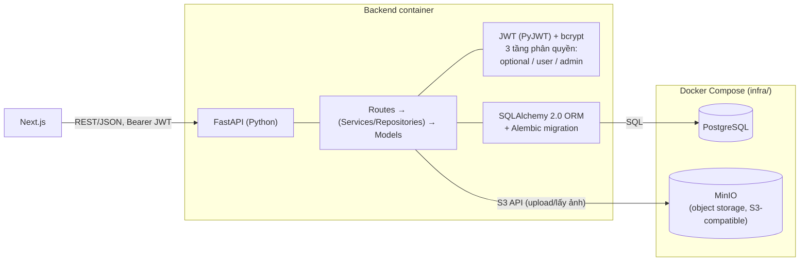
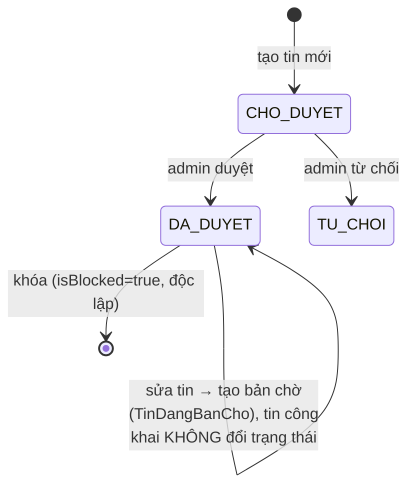

# Kịch bản Video Demo — Backend, Kiến trúc & Phân công nhóm (10 phút)

## Chuẩn bị trước khi quay (làm 1 lần)

- [ ] Chạy full stack: `docker compose -f infra/compose.yaml up -d --build` (có seed data sẵn).
- [ ] Mở sẵn trình duyệt với **2 cửa sổ** (không chung 1 profile để khỏi vướng phiên đăng nhập):
  1. **Cửa sổ thường** — đăng nhập sẵn bằng 1 tài khoản user thường (đã có sẵn vài tin đăng, trong
     đó có ít nhất 1 tin **đã đăng** để demo sửa tin tạo bản chờ duyệt).
  2. **Cửa sổ ẩn danh** — dùng để soi "người khác/khách vãng lai thấy gì" (tin công khai giữ
     nguyên khi có bản sửa chờ, tin bị khóa biến mất...) và để đăng nhập tài khoản admin khi tới
     đoạn 4b/4c/4d.
- [ ] Mở thêm 1 tab **VSCode** — cây thư mục `be/app` (models, api/routes) và `fe/src`, để chỉ
  nhanh code/kiến trúc lúc nói mục 2-3, không cần gõ hay chạy code trực tiếp.
- [ ] **Slide/hình** — xuất 2 sơ đồ Mermaid bên dưới (kiến trúc tổng quan + class diagram) ra ảnh
  (draw.io hoặc Markdown Preview) để chèn slide, tránh vừa quay vừa đọc code Mermaid thô.
- [ ] Chuẩn bị sẵn: 1 tin **đã đăng** để test sửa tin (Hải), 1 tin **chờ duyệt sẵn** + để dành 1
  tin đã đăng khác chưa đụng tới để tạo bản sửa ngay lúc quay (Anh), 1 tin đã đăng của người khác
  để báo cáo (Tiến), thư viện ảnh có sẵn vài tấm để khỏi phải upload từ đầu.
- [ ] Đóng các tab/notification không liên quan, chuẩn bị micro/giọng đọc theo lời thoại gợi ý.

---

## Mốc thời gian (tổng 10:00)

| # | Thời lượng | Khung giờ | Nội dung |
|---|---|---|---|
| 1 | 0:20 | 0:00 – 0:20 | Mở đầu |
| 2 | 1:00 | 0:20 – 1:20 | Kiến trúc tổng quan & công nghệ sử dụng (rút gọn) |
| 3 | 1:00 | 1:20 – 2:20 | Mô hình dữ liệu — Class diagram sơ lược (rút gọn) |
| 4 | 7:00 | 2:20 – 9:20 | Chức năng Backend (API) — trọng tâm, đi sâu từng module |
| 5 | 0:40 | 9:20 – 10:00 | Kết + Q&A dự phòng |

*(Phân công nhiệm vụ nhóm không quay trong video — xem phụ lục cuối file để đưa vào báo cáo.)*

---

## Phân công quay từng đoạn

> Quy ước: **Hải / Anh / Trinh / Tiến** — 4 thành viên nhóm, mỗi người gắn với đúng module mình đã
> làm (chi tiết module ở phụ lục cuối file). Người quay đoạn nào thì tự demo/nói đoạn đó bằng
> giọng mình, tránh 1 người đọc hộ hết kịch bản.

| Đoạn | Nội dung | Người quay | Thời lượng |
|---|---|---|---|
| 1 | Mở đầu | Trinh | 0:20 |
| 2 | Kiến trúc tổng quan & công nghệ | Trinh | 1:00 |
| 3 | Class diagram sơ lược | Trinh | 1:00 |
| 4a | API — Xác thực, Tin đăng, Danh mục, Thư viện ảnh | Hải | 2:30 |
| 4b | API — Quản lý người dùng (BE) + Duyệt/khóa/mở khóa tin đăng | Anh | 2:20 |
| 4c | API — Báo cáo vi phạm + Thống kê tổng quan | Tiến | 1:20 |
| 4d | Yêu thích, Tin tức thị trường | Tiến | 0:50 |
| 5 | Kết | Tiến | 0:40 |

*(4a–4d cộng lại đúng 7:00 của mục 4 — trọng tâm video theo đúng yêu cầu tập trung vào chức năng.
Trinh chỉ quay phần đầu 1→2→3 rồi thôi, không xuất hiện lại. Hải→Anh→Tiến quay nối tiếp đúng thứ
tự — Anh làm 4b, Tiến làm liền 4c→4d→Kết để khép video luôn. Mỗi người chỉ nói 1 lượt liên tục,
không ai swap qua lại giữa các đoạn. Nếu quay chung 1 người cho gọn thì bỏ qua bảng này, dùng 1
người đọc hết theo kịch bản gốc.)*

---

## 1) Mở đầu — 0:20 (Trinh)

**Màn hình:** Slide tên đề tài "UrbanLease".

**Nói:**
> "Ở phần trước nhóm đã demo tính năng theo giao diện người dùng. Phần này mình đi nhanh qua kiến
> trúc và mô hình dữ liệu, rồi tập trung phần lớn thời gian vào demo chức năng Backend."

---

## 2) Kiến trúc tổng quan & công nghệ sử dụng — 1:00 (Trinh)

**Màn hình:** Slide sơ đồ kiến trúc bên dưới.

**Nói (kiến trúc — nói nhanh, đi thẳng vào Backend):**
> "Frontend dùng Next.js, gọi Backend qua REST API/JSON. Backend viết bằng FastAPI, tổ chức theo
> 3 lớp: route validate bằng Pydantic, service/repository chứa logic nghiệp vụ, model là entity
> SQLAlchemy 2.0 ánh xạ xuống PostgreSQL — schema quản lý version bằng Alembic. Xác thực JWT, phân
> quyền 3 tầng: công khai / đăng nhập / admin. Ảnh không lưu trong PostgreSQL mà đẩy sang MinIO —
> object storage tách riêng, dễ scale. Toàn bộ đóng gói bằng Docker Compose. Phần sau mình sẽ demo
> trực tiếp các chức năng này."

---

## 3) Mô hình dữ liệu — Class diagram sơ lược — 1:00 (Trinh)

**Màn hình:** Slide class diagram bên dưới (đã lược bớt các cột phụ, chỉ giữ field chính + quan hệ).

**Nói (nói nhanh, chỉ tay theo sơ đồ):**
> "Trung tâm là `NguoiDung` và `TinDang`. Một người đăng nhiều tin, có thư viện ảnh riêng dùng lại
> được qua bảng nối `HinhAnhTinDang`. Sửa 1 tin đang công khai thì bản mới không ghi đè trực tiếp
> mà lưu tạm ở `TinDangBanCho` — tin công khai đứng yên cho tới khi admin duyệt bản sửa này. Người
> dùng còn tương tác qua `TinYeuThich` và `BaoCao`. Riêng địa giới hành chính lưu song song bản CŨ
> và bản MỚI sau sáp nhập, ánh xạ N-N với nhau để lọc được cả 2 kiểu. Phần API cho các bảng này
> mình demo ngay sau đây."

---

## 4) Chức năng Backend (API) — 7:00 — TRỌNG TÂM

**Màn hình:** Web app thật (UI), không dùng Swagger — thao tác trực tiếp trên giao diện, thỉnh
thoảng chêm tên API chạy phía sau để giữ chất kỹ thuật (vd "bấm Lưu ở đây là gọi PUT
`/api/rental-posts/{id}`"). Chia làm 4 đoạn nhỏ (4a-4d), mỗi đoạn 1 người quay.

Danh sách module Backend (theo file route thực tế trong `be/app/api/routes/`):

| Module | File | Chức năng chính | Đoạn/Người demo |
|---|---|---|---|
| Xác thực | `auth.py` | Đăng ký, đăng nhập (trả JWT), lấy thông tin bản thân, đổi mật khẩu | 4a — Hải |
| Tin đăng | `tin_dang.py` | Đăng/sửa/xóa mềm tin, tìm kiếm & lọc, xem chi tiết, danh sách "tin của tôi", sửa tin đã duyệt tạo bản chờ duyệt riêng (huỷ được) | 4a — Hải |
| Danh mục | `danh_muc.py` | Loại bất động sản, tỉnh/thành, quận/huyện, xã/phường (cũ & mới) | 4a — Hải |
| Thư viện ảnh | `thu_vien_anh.py` | Upload ảnh lên MinIO, đổi tên, xóa, danh sách ảnh cá nhân | 4a — Hải |
| Người dùng (BE) | `nguoi_dung.py` | Admin: danh sách người dùng, khóa/mở khóa tài khoản | 4b — Anh |
| Duyệt/khóa tin | `tin_dang.py` (phần admin) | Duyệt/từ chối tin chờ duyệt, khóa/mở khóa tin đăng | 4b — Anh |
| Báo cáo | `bao_cao.py` + `bao_cao_client.py` | Người dùng báo cáo tin vi phạm; admin xem & xử lý (duyệt/từ chối, kèm khóa tin nếu cần) | 4c — Tiến |
| Thống kê | `thong_ke.py` | Dashboard tổng quan (số tin/người dùng/chờ duyệt), phân tích giá thuê theo khu vực/loại hình | 4c — Tiến |
| Yêu thích | `tin_yeu_thich.py` | Lưu/bỏ lưu tin, danh sách tin yêu thích | 4d — Tiến |
| Tin tức | `bai_viet.py` + `bai_viet_client.py` | Admin soạn/đăng bài viết thị trường (rich-text, làm sạch HTML bằng `nh3`) | 4d — Tiến |

**API chạy phía sau mỗi thao tác UI (để nhắc miệng lúc demo, không mở Swagger):**

| Method | Path | Quyền | Ghi chú |
|---|---|---|---|
| POST | `/api/auth/login` | Công khai | Trả `accessToken` (JWT) + thông tin user |
| GET | `/api/rental-posts` | Công khai | Chỉ trả tin `DA_DUYET`, hỗ trợ `q`, `gia_tu/den`, `dien_tich_tu/den`, lọc theo tỉnh/quận/xã |
| GET | `/api/rental-posts/{id}` | Optional | Ẩn SĐT nếu chưa đăng nhập; tin chưa duyệt/bị khóa chỉ chủ tin/admin xem được |
| POST | `/api/rental-posts` | User | Tạo tin mới, trạng thái mặc định `CHO_DUYET` |
| PUT | `/api/rental-posts/{id}` | User (chủ tin) | Nếu đang `DA_DUYET`: KHÔNG đổi tin công khai, lưu bản sửa mới vào `TinDangBanCho` chờ duyệt |
| POST | `/api/rental-posts/{id}/huy-ban-cho-duyet` | User (chủ tin) | Huỷ bản sửa đang chờ — tin công khai giữ nguyên, không có gì đổi |
| POST | `/api/rental-posts/duyet-tin-dang/{id}` | Admin | Tin mới: `CHO_DUYET`→`DA_DUYET`. Tin có bản sửa chờ: áp bản sửa đè lên tin công khai |
| POST | `/api/rental-posts/khoa-tin-dang/{id}` | Admin | Đặt cờ `isBlocked` (độc lập với `trangThai`) |
| POST | `/api/bao-cao/{id}` | User | Gửi báo cáo — chặn nếu báo cáo trước còn `CHO_XU_LY` |
| PUT | `/api/admin/bao-cao/{id}/xu-ly` | Admin | Duyệt/từ chối báo cáo, có thể kèm khóa tin |

**Sơ đồ trạng thái tin đăng (`trang_thai`, độc lập với cờ `isBlocked`):**

**Nói (mở đầu mục 4 — Hải):**
> "Backend có 9 nhóm route chính, tổng hơn 50 endpoint, dùng chung 1 cơ chế phân quyền 3 tầng:
> công khai, bắt buộc đăng nhập, và chỉ admin. Thay vì mở Swagger, tụi mình demo thẳng trên web
> app — mỗi lần thao tác trên giao diện, mình sẽ nói rõ API nào chạy phía sau để các bạn thấy rõ
> Backend đứng sau UI như thế nào."

### 4a — Đăng nhập, Đăng ký, Tin đăng, Danh mục, Thư viện ảnh — 2:30 (Hải)

1. Trang **`/dang-ky`** — điền form đăng ký tài khoản (có thể dùng autofill cho nhanh), chuyển qua **`/dang-nhap`** để đăng nhập bằng tài khoản vừa tạo.
   > "Form đăng ký gọi `POST /api/auth/register`, còn đăng nhập gọi `POST /api/auth/login`, backend trả về JWT lưu ở trình duyệt để gọi các API cần xác thực sau đó."
2. Trang **`/danh-sach-nha-cho-thue`** — gõ từ khóa tìm kiếm, mở bộ lọc chọn khoảng giá/diện
   tích/khu vực, bấm áp dụng — danh sách lọc lại ngay.
   > "Mỗi lần đổi bộ lọc là 1 lần gọi `GET /api/rental-posts` với query param tương ứng."
3. Vào **`/tin-dang-cua-toi`**, bấm sửa 1 tin đang **"Đã đăng"** — đổi tiêu đề/giá — bấm Lưu. Mở
   lại trang sửa tin đó: thấy banner cam "Đang có bản chỉnh sửa chờ duyệt". Chuyển qua cửa sổ ẩn
   danh, mở trang chi tiết tin đó (`/chi-tiet-tin-dang/{id}`) — **chứng minh nội dung công khai
   vẫn y nguyên bản cũ**, chưa hề đổi.
   > "Đây là điểm kỹ thuật đáng chú ý nhất: bấm Lưu gọi `PUT /api/rental-posts/{id}`, nhưng vì tin
   > đang công khai nên backend KHÔNG ghi đè trực tiếp — lưu bản sửa mới vào 1 bảng riêng chờ
   > duyệt, tin công khai đứng yên cho tới khi admin duyệt. Nếu đổi ý, có nút 'Hủy bản chỉnh sửa
   > đang chờ duyệt' gọi `POST .../huy-ban-cho-duyet`, tin công khai coi như chưa từng bị đụng."
4. Trang **`/thu-vien-anh`** — upload thật 1 ảnh, ảnh lên danh sách ngay.
   > "Ảnh được đẩy thẳng lên MinIO qua `POST /api/image-library`, không lưu trong PostgreSQL."
5. (Admin) Trang **`/quan-tri/loai-bat-dong-san`** — thêm hoặc ẩn 1 loại bất động sản.
   > "Đây là nhóm chức năng đăng nhập, tin đăng, thư viện ảnh và danh mục. Phần quản lý người
   > dùng, duyệt tin và các module còn lại bạn tiếp theo demo."

### 4b — Quản lý người dùng & Duyệt/khóa/mở khóa tin đăng — 2:20 (Anh)

1. (Admin) Trang **`/quan-tri/nguoi-dung`** — xem danh sách, khóa 1 tài khoản.
   > "Khóa tài khoản gọi API cập nhật `trạng thái` người dùng — tài khoản bị khóa sẽ không đăng
   > nhập được nữa."
2. Trang **`/quan-tri/tin-dang`** (hàng đợi duyệt) — chỉ ra 2 loại badge trong cột "Yêu cầu": **"Tin
   mới"** và **"Chỉnh sửa"** (tin đã công khai đang có bản sửa chờ). Bấm icon mắt xem trước 1 tin
   có badge "Chỉnh sửa" — drawer hiện đúng **nội dung bản sửa**, chưa phải bản đang công khai.
   > "Hàng đợi này gộp cả tin mới và bản sửa của tin cũ vào 1 chỗ cho admin xử lý."
3. Bấm **Duyệt** trên 1 tin mới, rồi **Duyệt** trên tin có badge "Chỉnh sửa" — quay lại cửa sổ ẩn
   danh, F5 lại trang chi tiết tin vừa duyệt bản sửa: nội dung mới đã lên công khai.
   > "Cùng 1 API duyệt nhưng xử lý 2 trường hợp khác nhau: tin mới thì đổi trạng thái sang đã
   > duyệt, còn tin sửa thì áp nội dung bản sửa đè lên tin công khai rồi xóa bản chờ."
4. Bấm **Từ chối** trên 1 tin khác, nhập lý do trong modal — với tin có bản sửa chờ thì từ chối
   chỉ xóa bản sửa, tin công khai không đổi gì (khác hẳn từ chối tin mới — tin đó chuyển hẳn sang
   "Bị từ chối").
5. Vào trang chi tiết 1 tin đã đăng (admin), bấm khóa tin kèm lý do; vào trang danh sách "tin bị
   khóa" mở khóa lại. Mở cửa sổ ẩn danh vào thẳng trang chi tiết tin đang bị khóa bằng URL — trang
   báo "Không tìm thấy tin đăng", dù tin vẫn còn trong hệ thống.
   > "Khóa tin độc lập với trạng thái duyệt — khóa xong thì không ai ngoài chủ tin và admin xem
   > được tin đó nữa, kể cả gõ thẳng ID."

### 4c — Báo cáo vi phạm & Thống kê tổng quan — 1:20 (Tiến)

1. Mở 1 tin đã đăng của người khác, bấm nút **"Báo cáo vi phạm"**, chọn lý do trong modal, gửi.
2. Bấm báo cáo lại **ngay tin đó lần 2** — nhận thông báo lỗi "đang chờ quản trị viên xử lý".
   > "Đây là cơ chế chống spam — chặn báo cáo trùng khi báo cáo trước vẫn chưa được xử lý."
3. (Admin) Trang **`/quan-tri/bao-cao`** — mở 1 báo cáo, xử lý duyệt hoặc từ chối.
   > "Báo cáo được xử lý xong thì người dùng có thể báo cáo lại tin đó ngay, không còn bị giới hạn
   > thời gian nữa."
4. Trang **`/quan-tri/thong-ke`** — xem số liệu tổng quan (số tin, người dùng, tin chờ duyệt) và
   biểu đồ so sánh giá thuê theo khu vực/loại hình.
   > "Dashboard này là phần điểm cộng ngoài yêu cầu bắt buộc, giúp admin theo dõi hoạt động hệ
   > thống và tham khảo mặt bằng giá."

### 4d — Yêu thích, Tin tức thị trường — 0:50 (Tiến)

1. Bấm icon trái tim lưu 1 tin vào yêu thích ngay trên card/trang chi tiết; vào trang
   **`/yeu-thich`** xem lại, bấm bỏ lưu.
2. (Admin) Trang **`/quan-tri/tin-tuc`** — soạn 1 bài viết mới bằng trình soạn thảo rich-text,
   đăng bài.
   > "Nội dung HTML được làm sạch bằng thư viện `nh3` trước khi lưu, tránh chèn mã độc (XSS)."
3. Chuyển qua cửa sổ ẩn danh, vào **`/thong-tin-thi-truong`** xem bài viết vừa đăng — công khai,
   không cần đăng nhập.
   > "Phần tin tức thị trường: admin đăng bài, ai cũng xem được kể cả khách chưa đăng nhập."

---

## 5) Kết + Q&A dự phòng — 0:40 (Tiến)

**Màn hình:** Slide tổng kết kiến trúc.

> "Tóm lại, hệ thống dùng kiến trúc Next.js — FastAPI — PostgreSQL/MinIO, và nhóm vừa demo trực
> tiếp 9 nhóm chức năng Backend theo đúng module mỗi bạn phụ trách. Cảm ơn thầy/cô và các bạn đã
> theo dõi, nhóm sẵn sàng trả lời câu hỏi."

*(Dự phòng câu hỏi thường gặp: vì sao chọn FastAPI thay vì Django? vì sao tách MinIO thay vì lưu
ảnh trong DB/ổ đĩa server? vì sao có cả bảng địa giới cũ và mới? — nhóm nên thống nhất trước câu
trả lời ngắn cho các câu hỏi này.)*

---

## Ghi chú quay/dựng

- Quay từng mục (1→5, trong đó mục 4 tách 4a-4d) riêng rồi ghép — dễ quay lại khi lỡ lời.
- Phần 3 (class diagram) và phần 2 (kiến trúc) nên dùng ảnh tĩnh xuất từ Mermaid thay vì scroll
  code, tránh rối mắt người xem.
- Phần 4 (demo trên web app thật) là phần "sống" duy nhất — canh trước dữ liệu mẫu để thao tác
  không bị lỗi/chậm giữa chừng (1 tin đã đăng để test sửa tin/hủy bản sửa, 1 tin chờ duyệt sẵn,
  1 tin của người khác để báo cáo). Nhớ chuẩn bị sẵn cửa sổ ẩn danh để soi "người ngoài thấy gì".
- Theo đúng bảng "Phân công quay từng đoạn" ở trên: mỗi bạn tự quay đoạn của mình bằng giọng/mặt
  mình (đặc biệt là 4a-4d), rồi ghép các file lại theo đúng thứ tự — vẫn giữ tổng thời lượng theo
  bảng mốc thời gian.
- Đặt tên file quay theo đoạn (vd `doan-1-mo-dau.mp4`, `doan-4b-duyet-khoa-tin.mp4`...) để người
  dựng video ghép đúng thứ tự, khỏi nhầm.

---

## Phụ lục (đưa vào báo cáo viết, không quay trong video): Phân công nhiệm vụ nhóm

> Tổng hợp từ lịch sử commit thực tế của repo (`git log --author`) — chỉnh lại mô tả nếu chưa khớp
> phân công ban đầu của nhóm trước khi đưa vào báo cáo.

| Thành viên | Phụ trách chính | Module/Chức năng cụ thể |
|---|---|---|
| **Hải** | Backend lõi & Đăng tin | Xác thực (đăng ký/đăng nhập/JWT), CRUD tin đăng (đăng/sửa/xóa/tìm kiếm/lọc theo địa giới), thư viện ảnh (MinIO), quản lý danh mục loại BĐS + tỉnh/quận/phường, quản lý người dùng (BE), seed dữ liệu mẫu, dashboard thống kê thị trường |
| **Anh** | Duyệt & Khóa tin đăng | Danh sách tin chờ duyệt, chức năng duyệt/từ chối tin, khóa/mở khóa tin đăng (model + API + giao diện quản trị) |
| **Trinh** | Quản lý người dùng (FE) & Hạ tầng | Trang quản trị người dùng (danh sách, khóa tài khoản) phía frontend, cấu hình hạ tầng Docker/biến môi trường |
| **Tiến** | Báo cáo vi phạm & Thống kê | Chức năng gửi/xử lý báo cáo tin vi phạm, dashboard thống kê tổng quan, một phần danh sách/tạo tin phía frontend |
