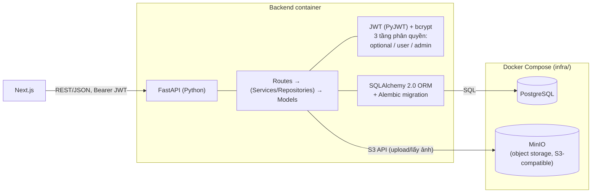
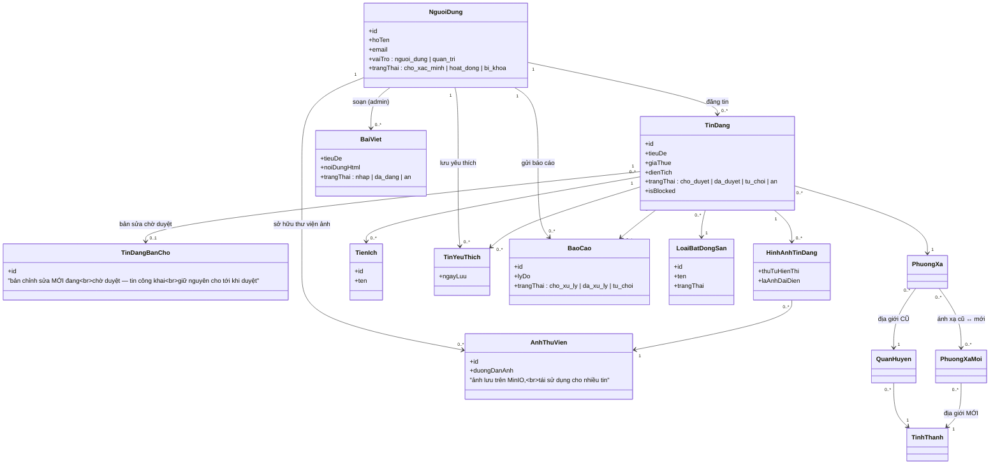
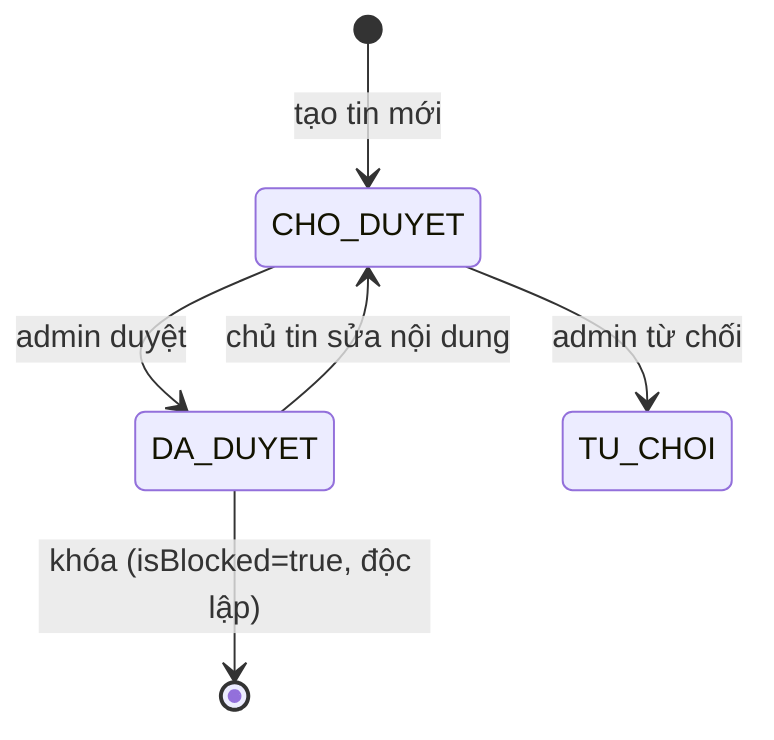

# Kịch bản Video Demo — Backend, Kiến trúc & Phân công nhóm (10 phút)

## Chuẩn bị trước khi quay (làm 1 lần)

- [ ] Chạy full stack: `docker compose -f infra/compose.yaml up -d --build` (có seed data sẵn).
- [ ] Mở sẵn 3 cửa sổ/tab:
  1. **Swagger UI** — `http://localhost:8000/docs` (demo API sống).
  2. **VSCode** — mở sẵn cây thư mục `be/app` (models, api/routes) và `fe/src` để chỉ nhanh khi nói
     về kiến trúc, không cần gõ code trực tiếp.
  3. **Slide/hình** — xuất 2 sơ đồ Mermaid bên dưới (kiến trúc tổng quan + class diagram) ra ảnh
     (dùng draw.io, hoặc render Mermaid trong VSCode/Markdown Preview) để chèn vào slide cho rõ,
     tránh việc vừa quay vừa đọc code Mermoid thô.
- [ ] Chuẩn bị 1 tài khoản admin để demo API cần quyền admin trên Swagger (nhập email/password khi
      gọi `/api/auth/login`, copy `accessToken` dán vào nút "Authorize" trên Swagger).
- [ ] Đóng các tab/notification không liên quan, chuẩn bị micro/giọng đọc theo lời thoại gợi ý.

---

## Mốc thời gian (tổng 10:00)

| # | Thời lượng | Khung giờ | Nội dung |
|---|---|---|---|
| 1 | 0:20 | 0:00 – 0:20 | Mở đầu |
| 2 | 1:00 | 0:20 – 1:20 | Kiến trúc tổng quan & công nghệ sử dụng (rút gọn) |
| 3 | 1:00 | 1:20 – 2:20 | Mô hình dữ liệu — Class diagram sơ lược (rút gọn) |
| 4 | 7:00 | 2:20 – 9:20 | Chức năng Backend (API) — trọng tâm, đi sâu từng module |
| 5 | 0:40 | 9:20 – 10:00 | Kết + Q&A dự phòng |

*(Phân công nhiệm vụ nhóm không quay trong video — xem phụ lục cuối file để đưa vào báo cáo.)*

---

## Phân công quay từng đoạn

> Quy ước: **Hải / Anh / Trinh / Tiến** — 4 thành viên nhóm, mỗi người gắn với đúng module mình đã
> làm (chi tiết module ở phụ lục cuối file). Người quay đoạn nào thì tự demo/nói đoạn đó bằng
> giọng mình, tránh 1 người đọc hộ hết kịch bản.

| Đoạn | Nội dung | Người quay | Thời lượng |
|---|---|---|---|
| 1 | Mở đầu | Trinh | 0:20 |
| 2 | Kiến trúc tổng quan & công nghệ | Trinh | 1:00 |
| 3 | Class diagram sơ lược | Trinh | 1:00 |
| 4a | API — Xác thực, Tin đăng, Danh mục, Thư viện ảnh | Hải | 2:30 |
| 4b | API — Quản lý người dùng (BE) + Duyệt/khóa/mở khóa tin đăng | Anh | 2:20 |
| 4c | API — Báo cáo vi phạm + Thống kê tổng quan | Tiến | 1:20 |
| 4d | Yêu thích, Tin tức thị trường | Tiến | 0:50 |
| 5 | Kết | Tiến | 0:40 |

*(4a–4d cộng lại đúng 7:00 của mục 4 — trọng tâm video theo đúng yêu cầu tập trung vào chức năng.
Trinh chỉ quay phần đầu 1→2→3 rồi thôi, không xuất hiện lại. Hải→Anh→Tiến quay nối tiếp đúng thứ
tự — Anh làm 4b, Tiến làm liền 4c→4d→Kết để khép video luôn. Mỗi người chỉ nói 1 lượt liên tục,
không ai swap qua lại giữa các đoạn. Nếu quay chung 1 người cho gọn thì bỏ qua bảng này, dùng 1
người đọc hết theo kịch bản gốc.)*

---

## 1) Mở đầu — 0:20 (Trinh)

**Màn hình:** Slide tên đề tài "UrbanLease".

**Nói:**
> "Ở phần trước nhóm đã demo tính năng theo giao diện người dùng. Phần này mình đi nhanh qua kiến
> trúc và mô hình dữ liệu, rồi tập trung phần lớn thời gian vào demo chức năng Backend."

---

## 2) Kiến trúc tổng quan & công nghệ sử dụng — 1:00 (Trinh)

**Màn hình:** Slide sơ đồ kiến trúc bên dưới.

**Nói (kiến trúc — nói nhanh, đi thẳng vào Backend):**
> "Frontend dùng Next.js, gọi Backend qua REST API/JSON. Backend viết bằng FastAPI, tổ chức theo
> 3 lớp: route validate bằng Pydantic, service/repository chứa logic nghiệp vụ, model là entity
> SQLAlchemy 2.0 ánh xạ xuống PostgreSQL — schema quản lý version bằng Alembic. Xác thực JWT, phân
> quyền 3 tầng: công khai / đăng nhập / admin. Ảnh không lưu trong PostgreSQL mà đẩy sang MinIO —
> object storage tách riêng, dễ scale. Toàn bộ đóng gói bằng Docker Compose. Phần sau mình sẽ demo
> trực tiếp các chức năng này."

---

## 3) Mô hình dữ liệu — Class diagram sơ lược — 1:00 (Trinh)

**Màn hình:** Slide class diagram bên dưới (đã lược bớt các cột phụ, chỉ giữ field chính + quan hệ).

**Nói (nói nhanh, chỉ tay theo sơ đồ):**
> "Trung tâm là `NguoiDung` và `TinDang`. Một người đăng nhiều tin, có thư viện ảnh riêng dùng lại
> được qua bảng nối `HinhAnhTinDang`. Sửa 1 tin đang công khai thì bản mới không ghi đè trực tiếp
> mà lưu tạm ở `TinDangBanCho` — tin công khai đứng yên cho tới khi admin duyệt bản sửa này. Người
> dùng còn tương tác qua `TinYeuThich` và `BaoCao`. Riêng địa giới hành chính lưu song song bản CŨ
> và bản MỚI sau sáp nhập, ánh xạ N-N với nhau để lọc được cả 2 kiểu. Phần API cho các bảng này
> mình demo ngay sau đây."

---

## 4) Chức năng Backend (API) — 7:00 — TRỌNG TÂM

**Màn hình:** Swagger UI (`/docs`), cuộn qua các nhóm tag; gọi thử API tiêu biểu theo từng module.
Chia làm 4 đoạn nhỏ (4a-4d), mỗi đoạn 1 người quay — xem chi tiết ai quay gì ở từng mục con.

Danh sách module Backend (theo file route thực tế trong `be/app/api/routes/`):

| Module | File | Chức năng chính | Đoạn/Người demo |
|---|---|---|---|
| Xác thực | `auth.py` | Đăng ký, đăng nhập (trả JWT), lấy thông tin bản thân, đổi mật khẩu | 4a — Hải |
| Tin đăng | `tin_dang.py` | Đăng/sửa/xóa mềm tin, tìm kiếm & lọc, xem chi tiết, danh sách "tin của tôi", sửa tin đã duyệt tạo bản chờ duyệt riêng (huỷ được) | 4a — Hải |
| Danh mục | `danh_muc.py` | Loại bất động sản, tỉnh/thành, quận/huyện, xã/phường (cũ & mới) | 4a — Hải |
| Thư viện ảnh | `thu_vien_anh.py` | Upload ảnh lên MinIO, đổi tên, xóa, danh sách ảnh cá nhân | 4a — Hải |
| Người dùng (BE) | `nguoi_dung.py` | Admin: danh sách người dùng, khóa/mở khóa tài khoản | 4b — Anh |
| Duyệt/khóa tin | `tin_dang.py` (phần admin) | Duyệt/từ chối tin chờ duyệt, khóa/mở khóa tin đăng | 4b — Anh |
| Báo cáo | `bao_cao.py` + `bao_cao_client.py` | Người dùng báo cáo tin vi phạm; admin xem & xử lý (duyệt/từ chối, kèm khóa tin nếu cần) | 4c — Tiến |
| Thống kê | `thong_ke.py` | Dashboard tổng quan (số tin/người dùng/chờ duyệt), phân tích giá thuê theo khu vực/loại hình | 4c — Tiến |
| Yêu thích | `tin_yeu_thich.py` | Lưu/bỏ lưu tin, danh sách tin yêu thích | 4d — Trinh |
| Tin tức | `bai_viet.py` + `bai_viet_client.py` | Admin soạn/đăng bài viết thị trường (rich-text, làm sạch HTML bằng `nh3`) | 4d — Trinh |

**Một số endpoint tiêu biểu (method, path, quyền yêu cầu):**

| Method | Path | Quyền | Ghi chú |
|---|---|---|---|
| POST | `/api/auth/login` | Công khai | Trả `accessToken` (JWT) + thông tin user |
| GET | `/api/rental-posts` | Công khai | Chỉ trả tin `DA_DUYET`, hỗ trợ `q`, `gia_tu/den`, `dien_tich_tu/den`, lọc theo tỉnh/quận/xã |
| GET | `/api/rental-posts/{id}` | Optional | Ẩn SĐT nếu chưa đăng nhập; tin chưa duyệt/bị khóa chỉ chủ tin/admin xem được |
| POST | `/api/rental-posts` | User | Tạo tin mới, trạng thái mặc định `CHO_DUYET` |
| PUT | `/api/rental-posts/{id}` | User (chủ tin) | Nếu đang `DA_DUYET`: KHÔNG đổi tin công khai, lưu bản sửa mới vào `TinDangBanCho` chờ duyệt |
| POST | `/api/rental-posts/{id}/huy-ban-cho-duyet` | User (chủ tin) | Huỷ bản sửa đang chờ — tin công khai giữ nguyên, không có gì đổi |
| POST | `/api/rental-posts/duyet-tin-dang/{id}` | Admin | Tin mới: `CHO_DUYET`→`DA_DUYET`. Tin có bản sửa chờ: áp bản sửa đè lên tin công khai |
| POST | `/api/rental-posts/khoa-tin-dang/{id}` | Admin | Đặt cờ `isBlocked` (độc lập với `trangThai`) |
| POST | `/api/bao-cao/{id}` | User | Gửi báo cáo — chặn nếu báo cáo trước còn `CHO_XU_LY` |
| PUT | `/api/admin/bao-cao/{id}/xu-ly` | Admin | Duyệt/từ chối báo cáo, có thể kèm khóa tin |

**Sơ đồ trạng thái tin đăng (`trang_thai`, độc lập với cờ `isBlocked`):**

**Nói (mở đầu mục 4 — Hải):**
> "Backend có 9 nhóm route chính, tổng hơn 50 endpoint. Toàn bộ dùng chung 1 cơ chế phân quyền theo
> 3 tầng qua dependency injection của FastAPI: `get_current_user_optional` cho route công khai
> nhưng có thể cá nhân hóa nếu đã đăng nhập; `get_current_user` cho route bắt buộc đăng nhập;
> `get_current_admin_user` cho route chỉ admin. Mình sẽ demo theo từng module, mỗi bạn trong nhóm
> trình bày đúng phần mình làm."

### 4a — Xác thực, Tin đăng, Danh mục, Thư viện ảnh — 2:30 (Hải)

1. `POST /api/auth/login` — đăng nhập bằng tài khoản admin, lấy `accessToken`, bấm "Authorize".
   > "Đăng nhập trả về JWT, dùng token này để gọi các API cần xác thực."
2. `GET /api/rental-posts` — gọi thử với vài query param (`q`, `gia_tu`, `gia_den`) để thấy tìm
   kiếm/lọc hoạt động ngay ở tầng API.
   > "Đây là API tìm kiếm — chỉ trả tin đã duyệt, hỗ trợ lọc theo giá, diện tích, khu vực."
3. `PUT /api/rental-posts/{id}` trên 1 tin đã duyệt (đổi tiêu đề, giá) — rồi gọi lại ngay
   `GET /api/rental-posts/{id}` để chứng minh tin công khai **không đổi gì** (title/giá cũ nguyên
   vẹn, người khác vẫn thấy bản cũ); sau đó gọi `GET /api/rental-posts/{id}/chinh-sua` để cho thấy
   bản sửa mới (`hasPendingEdit: true`) đang nằm chờ ở chỗ khác, chưa công khai.
   > "Điểm đáng chú ý: sửa 1 tin đang công khai KHÔNG ghi đè trực tiếp — bản sửa mới lưu riêng vào
   > bảng chờ duyệt, tin công khai đứng yên cho tới khi admin duyệt bản sửa này. Muốn hủy bản sửa
   > thì gọi `huy-ban-cho-duyet`, tin công khai coi như chưa từng bị đụng vào."
4. `POST /api/image-library` — upload thật 1 ảnh, chỉ ra ảnh được đẩy lên MinIO và trả về URL;
   `GET /api/image-library` — xem lại danh sách ảnh cá nhân, tái sử dụng cho nhiều tin.
5. `GET /api/loai-bat-dong-san`, `POST /api/loai-bat-dong-san/quan-tri` (admin thêm loại mới) —
   quản lý danh mục loại bất động sản.
   > "Đây là nhóm API xác thực, đăng tin, danh mục và thư viện ảnh — đều theo cùng 1 khuôn mẫu
   > request/response, dùng chung cơ chế phân trang và phân quyền vừa nói. Phần quản lý người
   > dùng, duyệt tin và các module còn lại bạn tiếp theo demo."

### 4b — Quản lý người dùng & Duyệt/khóa/mở khóa tin đăng — 2:20 (Anh)

1. `POST /api/auth/register` — đăng ký tài khoản mới; `POST /api/auth/doi-mat-khau` — đổi mật khẩu.
   > "Mật khẩu không lưu plaintext, hash bằng bcrypt trước khi ghi database."
2. `GET /api/users` — danh sách người dùng; cập nhật trạng thái 1 tài khoản (khóa/mở khóa).
   > "Admin quản lý tài khoản người dùng — khóa tài khoản vi phạm là chặn được đăng nhập ngay."
3. `GET /api/rental-posts/cho-duyet` — danh sách tin đang chờ duyệt, gồm cả tin MỚI và tin ĐÃ công
   khai đang có bản sửa chờ (đánh dấu `laChinhSua: true` — badge "Chỉnh sửa" khác với "Tin mới").
4. `POST /api/rental-posts/duyet-tin-dang/{id}` gọi 2 lần: 1 lần trên tin mới (`trang_thai` đổi
   `CHO_DUYET`→`DA_DUYET`), 1 lần trên tin có bản sửa chờ (bản sửa được áp lên tin công khai rồi
   `TinDangBanCho` bị xoá).
   > "Cùng 1 API duyệt nhưng xử lý 2 trường hợp khác nhau: tin mới thì đổi trạng thái, tin sửa thì
   > áp nội dung bản sửa lên tin công khai."
5. `POST /api/rental-posts/tu-choi-tin-dang/{id}` trên tin có bản sửa chờ — chỉ xoá bản sửa, tin
   công khai không đổi gì cả (khác với từ chối tin mới thì tin chuyển hẳn sang `TU_CHOI`).
6. `POST /api/rental-posts/khoa-tin-dang/{id}` rồi `POST /api/rental-posts/mo-khoa-tin/{id}` —
   khóa rồi mở khóa 1 tin đã duyệt, chỉ ra `isBlocked` bật/tắt độc lập với `trang_thai`.
7. Vào `GET /api/rental-posts/{id}` bằng tab ẩn danh khi tin đang bị khóa — chỉ ra tin biến mất
   khỏi kết quả, kể cả xem trực tiếp bằng ID.
   > "Nhóm API này cho admin kiểm duyệt nội dung trước khi hiển thị công khai, và khóa tin vi phạm
   > bất kể tin đang ở trạng thái nào — người ngoài không truy cập được tin đã khóa nữa."

### 4c — Báo cáo vi phạm & Thống kê tổng quan — 1:20 (Tiến)

1. `POST /api/bao-cao/{id}` — gửi báo cáo cho 1 tin đã duyệt (không phải tin của chính mình).
2. Gọi lại `POST /api/bao-cao/{id}` lần 2 ngay lập tức — bị chặn với lý do "đang chờ quản trị viên
   xử lý", minh họa cơ chế chống spam.
3. `GET /api/admin/bao-cao` — danh sách báo cáo (lọc theo trạng thái); `PUT /api/admin/bao-cao/{id}/xu-ly`
   — admin xử lý (duyệt/từ chối, có thể kèm khóa tin luôn).
   > "Người dùng báo cáo tin vi phạm, admin xem và xử lý; báo cáo đã xử lý xong thì người dùng có
   > thể báo cáo lại ngay, không giới hạn thời gian nữa."
4. `GET /api/thong-ke/tong-quan` — số tin/người dùng/tin chờ duyệt; `GET /api/thong-ke/so-sanh-khu-vuc`
   — so sánh giá thuê trung bình theo khu vực và loại hình.
   > "Đây là API phục vụ dashboard thống kê tổng quan cho admin theo dõi hoạt động hệ thống."

### 4d — Yêu thích, Tin tức thị trường — 0:50 (Tiến)

1. `POST /api/favorites/{id}` — lưu tin yêu thích; `GET /api/favorites` — xem lại danh sách;
   `DELETE /api/favorites/{id}` — bỏ lưu.
2. `GET /api/tin-tuc` (công khai, không cần đăng nhập) và `GET /api/tin-tuc/{slug}` — xem chi tiết
   1 bài viết thị trường.
3. `POST /api/admin/tin-tuc` — admin soạn bài mới bằng rich-text; nội dung HTML được làm sạch bằng
   `nh3` trước khi lưu để tránh XSS.
   > "Phần tin tức thị trường cho admin đăng bài, ai cũng xem được kể cả chưa đăng nhập."

---

## 5) Kết + Q&A dự phòng — 0:40 (Tiến)

**Màn hình:** Slide tổng kết kiến trúc.

> "Tóm lại, hệ thống dùng kiến trúc Next.js — FastAPI — PostgreSQL/MinIO, và nhóm vừa demo trực
> tiếp 9 nhóm chức năng Backend theo đúng module mỗi bạn phụ trách. Cảm ơn thầy/cô và các bạn đã
> theo dõi, nhóm sẵn sàng trả lời câu hỏi."

*(Dự phòng câu hỏi thường gặp: vì sao chọn FastAPI thay vì Django? vì sao tách MinIO thay vì lưu
ảnh trong DB/ổ đĩa server? vì sao có cả bảng địa giới cũ và mới? — nhóm nên thống nhất trước câu
trả lời ngắn cho các câu hỏi này.)*

---

## Ghi chú quay/dựng

- Quay từng mục (1→5, trong đó mục 4 tách 4a-4d) riêng rồi ghép — dễ quay lại khi lỡ lời.
- Phần 3 (class diagram) và phần 2 (kiến trúc) nên dùng ảnh tĩnh xuất từ Mermaid thay vì scroll
  code, tránh rối mắt người xem.
- Phần 4 (demo Swagger) là phần "sống" duy nhất — canh trước dữ liệu mẫu để gọi API không bị lỗi
  giữa chừng (dùng 1 tin đã duyệt có sẵn để test sửa tin/hủy bản sửa, 1 tin chờ duyệt, 1 báo cáo mẫu).
- Theo đúng bảng "Phân công quay từng đoạn" ở trên: mỗi bạn tự quay đoạn của mình bằng giọng/mặt
  mình (đặc biệt là 4a-4d), rồi ghép các file lại theo đúng thứ tự — vẫn giữ tổng thời lượng theo
  bảng mốc thời gian.
- Đặt tên file quay theo đoạn (vd `doan-1-mo-dau.mp4`, `doan-4b-duyet-khoa-tin.mp4`...) để người
  dựng video ghép đúng thứ tự, khỏi nhầm.

---

## Phụ lục (đưa vào báo cáo viết, không quay trong video): Phân công nhiệm vụ nhóm

> Tổng hợp từ lịch sử commit thực tế của repo (`git log --author`) — chỉnh lại mô tả nếu chưa khớp
> phân công ban đầu của nhóm trước khi đưa vào báo cáo.

| Thành viên | Phụ trách chính | Module/Chức năng cụ thể |
|---|---|---|
| **Hải** | Backend lõi & Đăng tin | Xác thực (đăng ký/đăng nhập/JWT), CRUD tin đăng (đăng/sửa/xóa/tìm kiếm/lọc theo địa giới), thư viện ảnh (MinIO), quản lý danh mục loại BĐS + tỉnh/quận/phường, quản lý người dùng (BE), seed dữ liệu mẫu, dashboard thống kê thị trường |
| **Anh** | Duyệt & Khóa tin đăng | Danh sách tin chờ duyệt, chức năng duyệt/từ chối tin, khóa/mở khóa tin đăng (model + API + giao diện quản trị) |
| **Trinh** | Quản lý người dùng (FE) & Hạ tầng | Trang quản trị người dùng (danh sách, khóa tài khoản) phía frontend, cấu hình hạ tầng Docker/biến môi trường |
| **Tiến** | Báo cáo vi phạm & Thống kê | Chức năng gửi/xử lý báo cáo tin vi phạm, dashboard thống kê tổng quan, một phần danh sách/tạo tin phía frontend |
